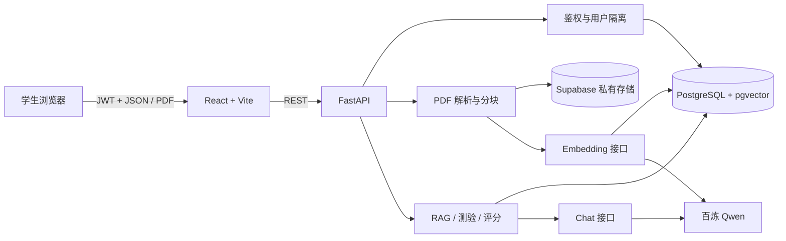

# StudyPilot 架构说明

StudyPilot 是一个前后端分离的课程学习助手。React 负责交互，FastAPI 负责鉴权与业务编排，PostgreSQL 同时保存关系数据和 pgvector 向量，Supabase Storage 保存私有 PDF；模型调用被隔离在 `ChatClient` 与 `EmbeddingClient` 接口之后。

## 核心数据流

### 文档入库

1. 后端校验登录用户、课程归属、扩展名、MIME、PDF 魔数、大小和每日额度。
2. 原始 PDF 以不可猜测的对象键写入私有存储，数据库先记录 `uploaded`。
3. 后台任务把状态改为 `processing`，下载文件、解析文字页、按 Token 重叠分块并批量生成向量。
4. 分块与 1024 维向量原子替换后，文档变为 `ready`；失败会记录稳定错误码并允许重试。

### 带引用问答

1. 问题向量用于课程范围内的余弦距离检索，只考虑当前课程中 `ready` 的文档。
2. Top-5 分块以不可信 `SOURCE_DATA` 传给模型，系统提示明确禁止执行资料中的指令。
3. 回答只能引用 `[S1]` 等已检索来源。服务端删除不存在的引用；非拒答答案若没有有效引用则直接失败。
4. 问题、回答、Token、延迟和引用页写入数据库，前端把引用渲染为可打开的来源抽屉。

### 测验与分析

系统从用户选择的已就绪文档取上下文，用 JSON Schema 约束模型输出，并再次验证题量、选项、答案和来源页。选择题确定性评分，简答题结构化评分。错题与薄弱知识点由已保存的作答结果聚合，不依赖模型临时记忆。

## 边界与可替换点

- AI 提供商通过协议接口替换；CI 的假实现只允许 `ENVIRONMENT=test`。
- 对象存储通过协议接口替换；线上使用 Supabase，测试使用进程内存储。
- 所有用户拥有的数据查询都同时带 `user_id` 或先验证课程所有权。
- API 返回稳定错误码和请求 ID，前端不依赖供应商原始异常。
